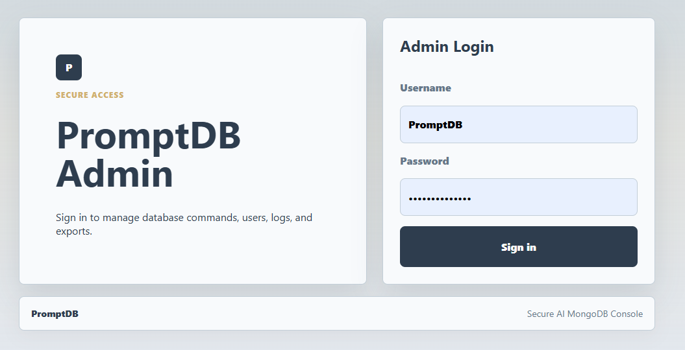
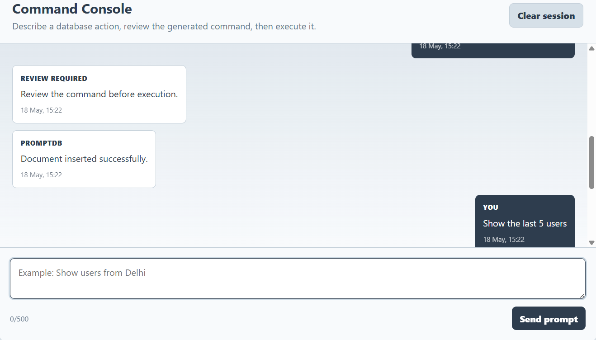
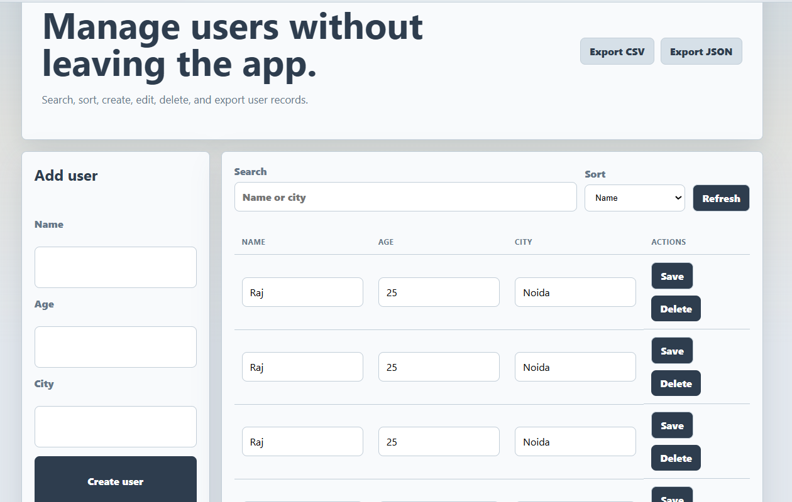

# PromptDB

Live Demo: https://promptdb-chatbot-fwnj.onrender.com

PromptDB is an AI-powered database operations platform that enables users to interact with MongoDB using natural language while enforcing validation, execution previews, audit logging, and administrative safeguards.

The platform is designed to reduce operational risk in AI-assisted database workflows by introducing confirmation layers, query validation, and transparent execution pipelines before database execution.

---

# Features

## AI Database Operations
- Convert natural language into MongoDB CRUD operations
- AI-assisted query generation using OpenRouter AI
- Dynamic query execution pipeline
- Intelligent command parsing and validation

## Secure Execution Workflow
- Preview database operations before execution
- Confirmation layer for insert, update, and delete actions
- Validation safeguards to reduce unsafe database operations
- Session-based admin authentication

## User Management Dashboard
- Create, edit, delete, and manage users
- Search and sort functionality
- Responsive dashboard interface
- Dynamic MongoDB data handling

## Audit & Monitoring
- Audit log dashboard for tracking actions
- Service status monitoring
- Flask, MongoDB, and OpenRouter health checks
- Execution transparency and operational tracking

## Data Export
- Export database records as CSV
- Export database records as JSON

## UI & Experience
- Responsive frontend design
- Clean dashboard-based interface
- Custom project color palette:
  - Light Gray
  - Dark Navy
  - Steel Blue
  - Sand Gold

---

# Architecture

Frontend (HTML/CSS/JavaScript)

↓

Flask Backend APIs

↓

AI Prompt Processing Layer

↓

Validation & Preview Engine

↓

MongoDB Execution Layer

↓

Audit Logging System

The application separates AI interpretation from database execution through a validation and preview pipeline to reduce unsafe operations and improve execution transparency.

---

# Tech Stack

## Backend
- Python
- Flask

## Database
- MongoDB Atlas

## AI Integration
- OpenRouter AI

## Frontend
- HTML
- CSS
- JavaScript

## Tools & Services
- Render
- Git
- GitHub

---

# Security Features

- Session-based admin authentication
- Protected environment variables
- Write operation confirmation workflow
- Query validation before execution
- Audit logging for database activity

---

# Screenshots

## Login Dashboard


## AI Query Interface


## Users Management Dashboard


## Audit Logs Dashboard

---

# Live Application

## Open PromptDB
https://promptdb-chatbot-fwnj.onrender.com

---

# Local Setup

## Clone Repository

```bash
git clone https://github.com/Mubasshir-31/PromptDB-Chatbot.git
cd PromptDB-Chatbot
```

## Create Virtual Environment

### Windows (PowerShell)

```powershell
uv python install 3.13
uv venv --python 3.13 .venv
.\.venv\Scripts\Activate.ps1
```

## Install Dependencies

```bash
pip install -r requirements.txt
```

## Run Application

```bash
python app.py
```

Open:

```text
http://127.0.0.1:5000
```

---

# Environment Variables

Create a `.env` file in the project root:

```env
MONGO_URI=your-mongodb-uri
OPENROUTER_API_KEY=your-openrouter-api-key
OPENROUTER_MODEL=openrouter/free
FLASK_SECRET_KEY=your-long-random-secret
ADMIN_USERNAME=your-admin-username
ADMIN_PASSWORD=your-admin-password
```

Important:
- Never commit `.env`
- Store secrets securely
- Use strong production credentials

---

# Main Routes

```text
/login
/
/users
/logs
/features
/about
/contact
```

---

# API Routes

```text
GET    /health
GET    /api/status
GET    /api/examples
POST   /api/preview
POST   /chat
GET    /api/users
POST   /api/users
PATCH  /api/users/:id
DELETE /api/users/:id
GET    /api/logs
GET    /api/export/users.csv
GET    /api/export/users.json
```

---

# Deployment

PromptDB is deployed on Render with MongoDB Atlas as the cloud database backend.

---

# Future Improvements

- Multi-database support
- Dockerized deployment
- Role-based access control (RBAC)
- Real-time monitoring dashboard
- Async task queues
- Query analytics
- AI schema intelligence
- WebSocket-based live updates
- PostgreSQL support

---

# Resume Description

Built PromptDB, an AI-powered database operations platform using Flask, MongoDB Atlas, and OpenRouter AI that converts natural language into validated CRUD workflows with execution previews, audit logging, admin authentication, and secure API handling.

---

# Author

MOHD MUBASSHIR KHAN

GitHub:
https://github.com/Mubasshir-31

LinkedIn:
https://www.linkedin.com/in/mohd-mubasshir-khan-0553121bb/